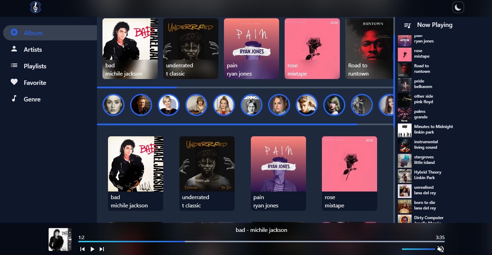

# Music cloud ui

created with tailwind css, material ui and react js

[Live Demo]()

 

 
 

# for installing dependencies run in terminal

`npm install`

# for starting development server

`npm start`

# building for production

`npm run build`
