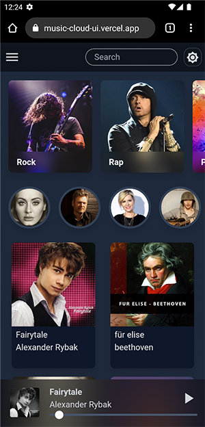
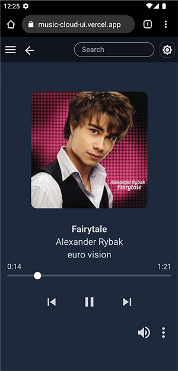

# Music cloud ui

created with tailwind css, material ui and react js

[Live Demo](https://musiccloud.pythonanywhere.com/)

 
desktop view

mobile view

 
 

for installing dependencies run in terminal

`npm install`

for starting development server

`npm start`

building for production

`npm run build`
